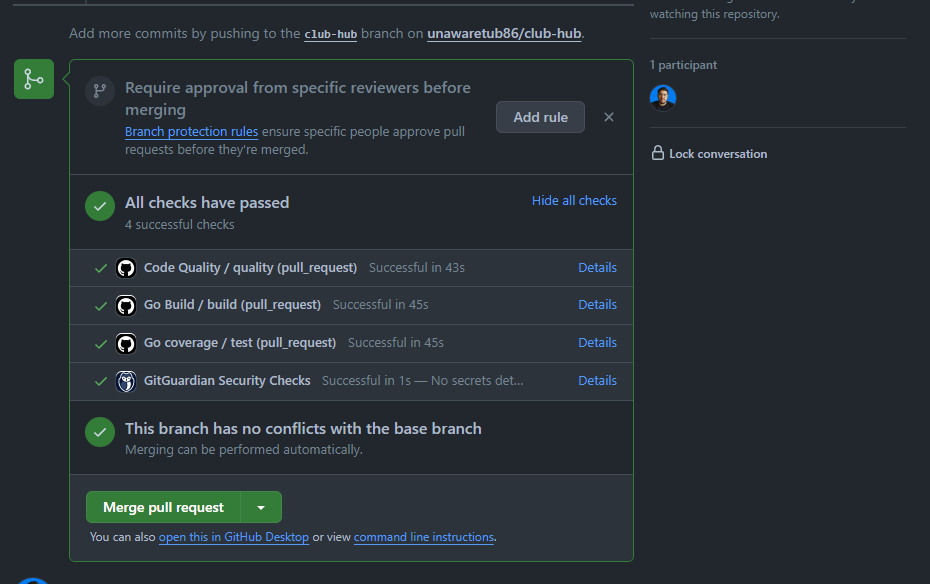
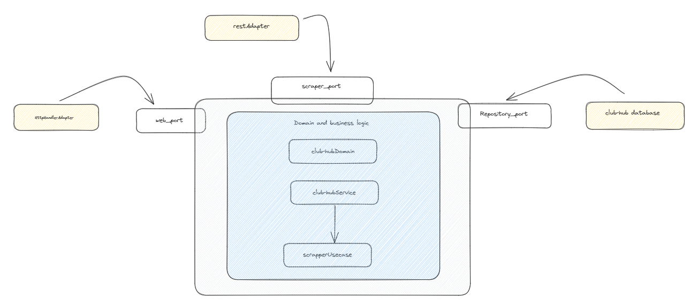

# club-hub
Go rest para obtener informacion de compañias

<!-- TABLE OF CONTENTS -->

  
Tabla de contenidos

  <ol>
    <li>
      <a href="#sobre-el-proyecto">Sobre el proyecto</a>
      <ul>
        <li><a href="#hecho-con">Hecho con</a></li>
      </ul>
    </li>
    <li><a href="#uso">Usage</a></li>
    <li><a href="#contacto">Contacto</a></li>
  </ol>

<!-- ABOUT THE PROJECT -->
## Sobre el proyecto

Este proyecto se ha desarrollado en el contexto de la prueba técnica Club-hub. En esta prueba, se presenta un servicio Rest

El propósito de este servicio es Guardar, obtener y actualiar la informacion de una compañia y hacer scrapping de cierta informacion solicitada. Esto se logra una vez que se ha recibido la informacion de las franquicias

Este servicio utiliza una arquitectura hexagonal diseñada para preservar la integridad de la lógica de negocio y permitir la incorporación de nuevas implementaciones a través de adaptadores, sin necesidad de modificar la lógica existente. Esta estructura proporciona flexibilidad para extender y adaptar el servicio a futuras necesidades, garantizando la coherencia de la aplicación.

En este servicio, hemos incorporado flujos de trabajo de GitHub Actions para asegurar la alta calidad de integración de Git Flow a través de pull requests. Estos flujos de trabajo incluyen acciones como construcción (build), cobertura superior al 80% (coverage) y verificación de código (lint). Esta implementación garantiza una integración fluida y una revisión exhaustiva del código, lo que nos permite mantener altos estándares de calidad en nuestro proyecto.

(<a href="#readme-top">Volver al inicio</a>)

### Hecho con

* Gin-Gonic Server
* Hexagonal architecture
* Go mock
* Docker
* postgres

* [![Go][Go.dev]][Go-url]
* [![Github][github.com]][Github-url]
* [![Github Actions][github-actions.com]][GithubActions-url]

(<a href="#readme-top">Volver al inicio</a>)

<!-- USAGE EXAMPLES -->
## Uso

* Install Golang
* Clone this repository: git clone [Github repo](https://github.com/unawaretub86/club-hub)
* Run the project: make start.

* [Club hub post](docs/post.md) : `POST /company`
* [Club hub patch](docs/patch.md) : `patch /company/:id`
* [Club hub franchise](docs/franchise.md) : `GET /company/franchise`
* [Club hub information](docs/information.md) : `GET /company/information`
* [Club hub owner](docs/owner.md) : `GET /company/owner`

* Aca la documentacion
* [Club hub Swagger](http://localhost:8081/)`

(<a href="#readme-top">Volver al inicio</a>)

<!-- CONTACT -->
## Contacto

Esteban Gomez - [LinkedIn](https://www.linkedin.com/public-profile/settings?lipi=urn%3Ali%3Apage%3Ad_flagship3_profile_self_edit_contact-info%3BSnAu1%2F2AQQiK8pzcnqrLUA%3D%3D) - goal.esteban10@gmail.com

Project Link: [Github repo](https://github.com/unawaretub86/club-hub)

(<a href="#readme-top">Volver al inicio</a>)

<!-- MARKDOWN LINKS & IMAGES -->
<!-- https://www.markdownguide.org/basic-syntax/#reference-style-links -->
[linkedin-shield]: https://img.shields.io/badge/-LinkedIn-black.svg?style=for-the-badge&logo=linkedin&colorB=555
[linkedin-url]: https://linkedin.com/in/othneildrew
[Go.dev]: https://img.shields.io/badge/go-%2300ADD8.svg?style=for-the-badge&logo=go&logoColor=white
[Go-url]: https://go.dev/
[github.com]: https://img.shields.io/badge/github-%23121011.svg?style=for-the-badge&logo=github&logoColor=white
[Github-url]: https://github.com/
[github-actions.com]: https://img.shields.io/badge/github%20actions-%232671E5.svg?style=for-the-badge&logo=githubactions&logoColor=white
[GithubActions-url]: https://github.com/features/actions
