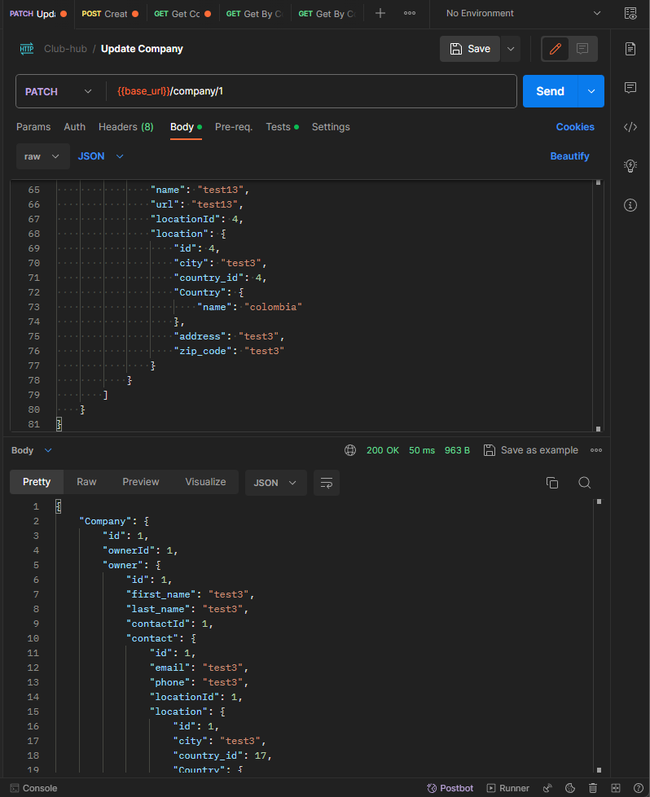

# Club-hub Patch

```
curl --location --request PATCH 'http://localhost:8080/company/1' \
--header 'Content-Type: application/json' \
--data '{
    "Company": {
        "id": 1,
        "ownerId": 1,
        "owner": {
            "id": 1,
            "first_name": "test3",
            "last_name": "test3",
            "contactId": 1,
            "contact": {
                "id": 1,
                "email": "test3",
                "phone": "test3",
                "locationId": 1,
                "location": {
                    "id": 1,
                    "city": "test3",
                    "country_id": 1,
                    "Country": {
                        "name": "colombia"
                    },
                    "address": "test3",
                    "zip_code": "test3"
                }
            }
        },
        "informacionId": 1,
        "informacion": {
            "id": 1,
            "name": "test3",
            "tax_number": "test3",
            "locationId": 2,
            "location": {
                "id": 2,
                "city": "test3",
                "country_id": 1,
                "Country": {
                    "name": "colombia"
                },
                "address": "test3",
                "zip_code": "test3"
            }
        },
        "franchises": [
            {
                "id": 1,
                "companyId": 1,
                "name": "test3",
                "url": "test3",
                "locationId": 3,
                "location": {
                    "id": 3,
                    "city": "Cancun",
                    "country_id": 2,
                    "Country": {
                        "name": "colombia"
                    },
                    "address": "test3",
                    "zip_code": "test3"
                }
            },
            {
                "id": 2,
                "companyId": 1,
                "name": "test13",
                "url": "test13",
                "locationId": 4,
                "location": {
                    "id": 4,
                    "city": "test3",
                    "country_id": 4,
                    "Country": {
                        "name": "colombia"
                    },
                    "address": "test3",
                    "zip_code": "test3"
                }
            }
        ]
    }
}'
```



