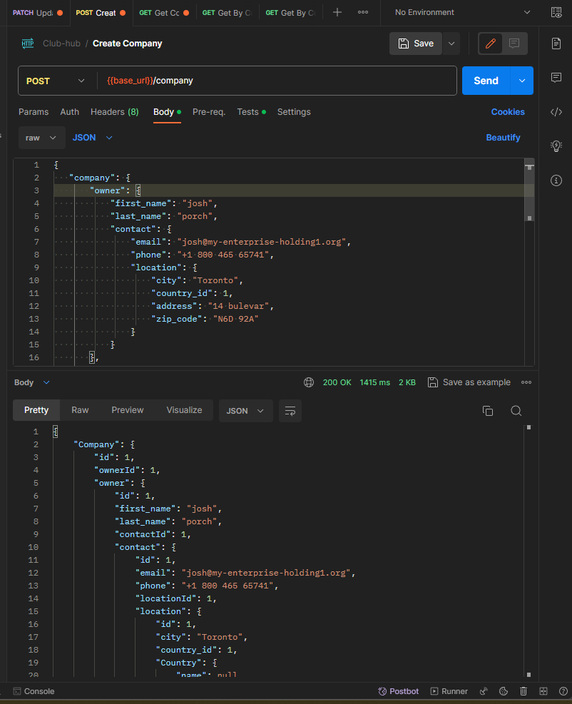

# Club-hub Post 

```
curl --location 'http://localhost:8080/company' \
--header 'Content-Type: application/json' \
--data-raw '{
   "company": {
       "owner": {
           "first_name": "josh",
           "last_name": "porch",
           "contact": {
               "email": "josh@my-enterprise-holding1.org",
               "phone": "+1 800 465 65741",
               "location": {
                   "city": "Toronto",
                   "country_id": 1,
                   "address": "14 bulevar",
                   "zip_code": "N6D 92A"
               }
           }
       },
       "informacion": {
           "name": "My entreprise holding",
           "tax_number": "DD79654121",
           "location": {
               "city": "Toronto",
               "country_id": 1,
               "address": "78 Rober ST",
               "zip_code": "F9A 92O"
           }
       },


   "franchises": [
       {
           "name": "Park royal",
           "url": "www.park-royalhotels.com",
           "location": {
               "city": "Cancun",
               "country_id": 2,
               "Address": "Libertadores av 40 - 20",
               "zip_code": "45971"
           }
       },
       {
           "name": "Marriot",
           "url": "www.marriott.com",
           "location": {
               "city": "Miami",
               "country_id": 4,
               "Address": "35 Tom st 18 bridge av",
               "zip_code": "115745"
           }
       }
   ]
   }
}
'
```

Response :

